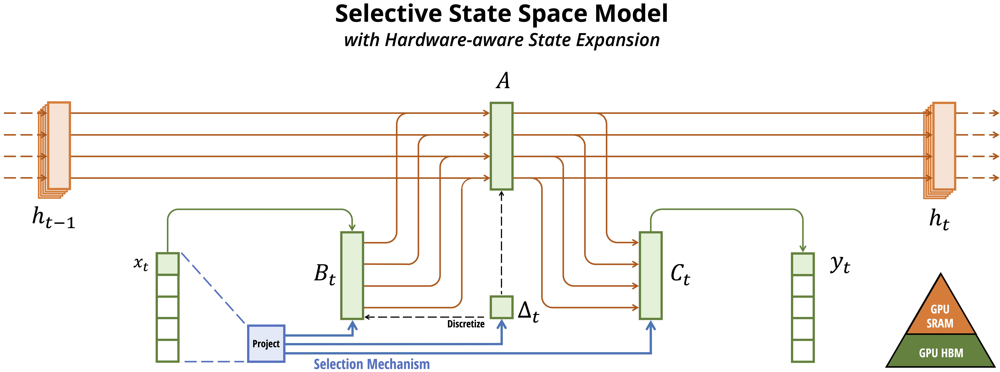
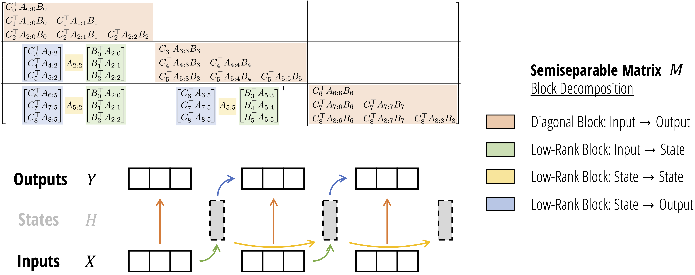

[1]: https://huggingface.co/state-spaces/mamba-2.8b-hf
[2]: https://github.com/state-spaces/mamba
[3]: https://github.com/confucianfighter/mamba-2.8b-hf-breakdown/blob/main/mamba_ssm/models/mixer_seq_simple.py

# [Mamba 2.8b hugging face LLM][1] breakdown.
***note: original readme appended to bottom for quick access.***

This repo is a clone of the [original mamba repo][2], with documentation and clarifying comments using a specific model.

I'm using the original mamba architecture, simply because the step function in that version includes less hardware optimizations and is easier to follow.

The easiest code entry point for mamba LLMs, is in [models/mixer_seq_simple.py][3].

It contains a create_block function and two classes:
- MixerModel(nn.Module)
    - has a list of block instances "layers".
    - uses the "create_block" function"
- MambaLMHeadModel(nn.Module)
  - has a MixerModel instance called "backbone"
  - has an lm head that projects from model dimensions to vocab dimensions. The values in these outputs being logits (list of next token probabilites)
  - has the learned embeddings for the tokens.
  - does not have the tokenizer itself.

The main architecture of mamba is within:

- Mamba(nn.Module)
  - all parallelizable operations happen within this this class
  - in the case of the hugging face llm, there are 64 layers containing an instance of Mamba and an MLP
  - The instances have their own xzBCdt etc (in case anyone else was confused about that)
  - The instances do not run in parallel
   
Within the MixerModel class A block is an abstraction and could be a mamba1 block, a mamba2 block, or a transformer block. It represents the fundamental unit for each architecture. For instance, if it's a transformer block, it includes both the attention mechanism and the FFN.

There is a list called transformer_idx within MixerModel that contains indices of all blocks that should be implemented as transformers.

MixerModel refers to the attention mechanism type (mamba1, mamba2 or transformer) as the mixer_cls.

They are referring to the transformer FFN and the mamba equivalent as the "mlp_cls".

This particular model only uses mamba blocks. I included comments in mamba_simple.py that breaks down the dimensionality and shape at each step in this 2.8b example.

I included the config file for this model in the model folder. I also included full config further below.

### Functional Description

We are using a 2560 dimensional model, tokenization occurs elsewhere within the huggingface ecosystem, all the MambaLMHead class needs to know is vocab size and model dimensions and it initializes and stores the learned embeddings of each token.

So during inference, it takes a token ID, looks up the embedding, and performs normalization on it (RMSNorm in our case)

Each block first takes in as many 2560 dimensional embeddings as are available in the sequence. Either the token embeddings or all outputs in the sequence given from the previous block. The blocks, are not parallelizeable because their inputs are dependent on the outputs of the previous block, but most operations on the available sequence are parallizable. But in the step function, sequence length is one and only the previous state and previous 4 convolutional inputs are stored.

Those embeddings are the size of d_model, which in our case is 2560.

Most processing within the block are done on a projection of double the model dimensions. But the first projection is quadruple, each  input is projected to a 10,240 dimensional vector, half representing x and half representing z. 10,240 is double the inner dimensions of the model (5120)

the z half is left alone, though. It is later used to gate the final state output with the swish function during the non parallel part of the state update. Swish is sigmoid of x times x, so picture sigmoid of z times z times x.

From there there is a matrix of learned weights the size of d_conv (4) and inner dimensions (5120). This convolution is performed depthwise along the last four 5120 dimensional embeddings in the sequence, such that there is a separate and unique convolution for each of 5120 channels. The convolution is taken as a simple dot product of 4 values at each channel.

The output of that is a 5120 dimensional embedding. 

The convolution can be performed in parallel over all available inputs in the sequence.

That 5120 dimensional embedding is projected down to 192 dimensions via x_proj as x_db.

That 192 dimensional x_db vector is split into:
  - a 160 dimensional dt vector, 
  - a 16 dimensional B vector, 
  - and a 16 dimensional C vector.

dt is projected from 160 to a 5120 dimensional vector.

The learned A matrix (16 by 5120) is then computed as the negative exponent of A_log. A_log was stored as the log of A, so this is a retrieval of a fixed learned value. This is done for stability during training.

"A" represents a continuous transition (instantaneous rate of change). It therefore must be "discretized" in order to convert that into time steps. I gather that this is analogous to computing what the daily interest rate should be in order to achieve some compounded result a year from now. Or perhaps the inverse of that.

So from that discretized dt we obtain the discretized dA 

dA is 16 by 5120

dB is calculated using the same operation as A by dt, but without exponentiating the result afterward.

ssm_state (16 by 5120) is then decayed by being multiplied by dA. 

x (the original output from the convolution) is then multiplied by dB and the resulting 16 by 5120 matrix is added to ssm_state.

ssm_state is then multiplied by C(16 dimensions) to obtain the 5120 dimensional y vector.

that same 5120 dimensional x is then multiplied element wise by a learned D vector and added to y (presumably as a normalized residual).

y is then activated  multiplying by the swish of that z vector that was set aside earlier to obtain a 5120 dimensional vector.

That vector is then projected back down to the model dimensions (2560) and at the block level RMSNorm or RMSNormGated are applied and it's sent through an MLP before passing 'u' on to the next block.

In the case of our LLM, the final output is normalized,projected to a vector of vocab size, and then activated by the softmax function. Each value in this vector represents the probability of that word being the output. These values are collectively referred to as the logits. The system can then select the top logit or randomly from among some top percentile. 


### Why does this work?

While the convolution on the next block only goes 4 back, when trained end to end, since the next input is based on lots of context gathered from compressed states, the system should be able to learn to apply that convolution across an arbitrarily spaced pattern of 4 on each channel.

Most of the pattern matching that a transformer would do with query and key seem to be via that convolution. 

The state space seems mostly responsible for selective suppression of unimportant information and compression. 

x, B, and C are equated to the V, K, and Q of transformers.

This would seem to make sense, as it is ultimately x that gets added to the state but after being transformed by the dB matrix as a key.

C then retrieves info from the state whilst simultaneously converting it back into an intermediate value through a projection

From there z further acts as a query and transformation from key to value by gating the output.

While the transformer is more intuitive as a mechanism that matches keys and give disparate outputs based on those keys, mamba is less intuitive to me as of yet. I mean, it's literally convoluted.

My own suspicion is that most of the pattern matching is being done by the convolution. 

### My own thoughts:

This model is proven to be efficient and compressive.

The convolution seems to be doing something very similar to the pattern matching in the attention heads of the transformer. The transformer uses the entire context and so can take the dot product horizontally whereas mamba is using a compressed context and takes the dot product vertically. So this may not be acting like a typical convolution because it's over compressed states and you want more than just mathematical pattern matching. It's miraculous they can compress so much over a depth of 4. 

However, I can't help but think that by increasing the depth we could get a quadratic return in capturing long range dependencies and a much better return on the compression strategy.

Another possibility is to both increase the depth and also do something similar to the softmax activation on either the columns or rows of the conv, pass the conv output forward as is, but apply that softmax as the gating weights (z). If softmax is too sharp in this scenario, perhaps softplus. 

But there may be some pattern matching in the state space processing that I'm missing, so this will be updated.

#### My opinion on the logits

Do the logits represent probability, or do we calculate the loss on the logits according to probability because that's the best we can do? We would hope that the logits represent intelligent logical operations from within the system. And if all we needed was probability of the next word, we wouldn't need to train an LLM! We could just keep a large dictionary of NLog probs. Sure it would be big, but it would be a much smaller engineering feat!

### Here's the config. It can also be found in models/mamba_2.8b_hf_config.json in this repo:
```json
{
  "architectures": [
    "MambaForCausalLM"
  ],
  "bos_token_id": 0,
  "conv_kernel": 4,
  "eos_token_id": 0,
  "expand": 2,
  "fused_add_norm": true,
  "hidden_act": "silu",
  "hidden_size": 2560,
  "initializer_range": 0.1,
  "intermediate_size": 5120,
  "layer_norm_epsilon": 1e-05,
  "model_type": "mamba",
  "n_layer": 64,
  "num_hidden_layers": 64,
  "pad_token_id": 0,
  "pad_vocab_size_multiple": 8,
  "rescale_prenorm_residual": false,
  "residual_in_fp32": true,
  "rms_norm": true,
  "state_size": 16,
  "time_step_floor": 0.0001,
  "time_step_init_scheme": "random",
  "time_step_max": 0.1,
  "time_step_min": 0.001,
  "time_step_rank": 160,
  "time_step_scale": 1.0,
  "torch_dtype": "float32",
  "transformers_version": "4.39.0.dev0",
  "use_bias": false,
  "use_cache": true,
  "use_conv_bias": true,
  "vocab_size": 50280
}
```

-----------------------------------------
# Original Readme


# Mamba


> **Mamba: Linear-Time Sequence Modeling with Selective State Spaces**\
> Albert Gu*, Tri Dao*\
> Paper: https://arxiv.org/abs/2312.00752


> **Transformers are SSMs: Generalized Models and Efficient Algorithms**\
>     **Through Structured State Space Duality**\
> Tri Dao*, Albert Gu*\
> Paper: https://arxiv.org/abs/2405.21060

## About

Mamba is a new state space model architecture showing promising performance on information-dense data such as language modeling, where previous subquadratic models fall short of Transformers.
It is based on the line of progress on [structured state space models](https://github.com/state-spaces/s4),
with an efficient hardware-aware design and implementation in the spirit of [FlashAttention](https://github.com/Dao-AILab/flash-attention).

## Installation

- [Option] `pip install causal-conv1d>=1.2.0`: an efficient implementation of a simple causal Conv1d layer used inside the Mamba block.
- `pip install mamba-ssm`: the core Mamba package.

It can also be built from source with `pip install .` from this repository.

If `pip` complains about PyTorch versions, try passing `--no-build-isolation` to `pip`.

Other requirements:
- Linux
- NVIDIA GPU
- PyTorch 1.12+
- CUDA 11.6+

For AMD cards, see additional prerequisites below.

## Usage

We expose several levels of interface with the Mamba model.

### Selective SSM

Mamba is based on a selective SSM layer, which is the focus of the paper (Section 3; Algorithm 2).

Source: [ops/selective_scan_interface.py](mamba_ssm/ops/selective_scan_interface.py).

### Mamba Block

The main module of this repository is the Mamba architecture block wrapping the selective SSM.

Source: [modules/mamba_simple.py](mamba_ssm/modules/mamba_simple.py).

Usage:
``` python
import torch
from mamba_ssm import Mamba

batch, length, dim = 2, 64, 16
x = torch.randn(batch, length, dim).to("cuda")
model = Mamba(
    # This module uses roughly 3 * expand * d_model^2 parameters
    d_model=dim, # Model dimension d_model
    d_state=16,  # SSM state expansion factor
    d_conv=4,    # Local convolution width
    expand=2,    # Block expansion factor
).to("cuda")
y = model(x)
assert y.shape == x.shape
```

### Mamba-2

The Mamba-2 block is implemented at [modules/mamba2.py](mamba_ssm/modules/mamba2.py).

A simpler version is at [modules/mamba2_simple.py](mamba_ssm/modules/mamba2_simple.py)

The usage is similar to Mamba(-1):
``` python
from mamba_ssm import Mamba2
model = Mamba2(
    # This module uses roughly 3 * expand * d_model^2 parameters
    d_model=dim, # Model dimension d_model
    d_state=64,  # SSM state expansion factor, typically 64 or 128
    d_conv=4,    # Local convolution width
    expand=2,    # Block expansion factor
).to("cuda")
y = model(x)
assert y.shape == x.shape
```

#### SSD

A minimal version of the inner SSD module (Listing 1 from the Mamba-2 paper) with conversion between "discrete" and "continuous" SSM versions
is at [modules/ssd_minimal.py](mamba_ssm/modules/ssd_minimal.py).

### Mamba Language Model

Finally, we provide an example of a complete language model: a deep sequence model backbone (with repeating Mamba blocks) + language model head.

Source: [models/mixer_seq_simple.py](mamba_ssm/models/mixer_seq_simple.py).

This is an example of how to integrate Mamba into an end-to-end neural network.
This example is used in the generation scripts below.


## Pretrained Models

Pretrained models are uploaded to
[Hugging Face](https://huggingface.co/state-spaces): `mamba-130m`, `mamba-370m`,
`mamba-790m`, `mamba-1.4b`, `mamba-2.8b`, `mamba2-130m`, `mamba2-370m`,
`mamba2-780m`, `mamba2-1.3b`, `mamba2-2.7b`, `transformerpp-2.7b`, `mamba2attn-2.7b`, trained on 300B tokens on the Pile, as well as `mamba-2.8b-slimpj`
(trained on 600B tokens on the SlimPajama dataset).


The models will be autodownloaded by the generation script below.

These models were trained on the [Pile](https://huggingface.co/datasets/EleutherAI/pile), and follow the standard model dimensions described by GPT-3 and followed by many open source models:

| Parameters | Layers | Model dim. | 
|------------|--------|------------|
| 130M       | 24     | 768        |
| 370M       | 48     | 1024       |
| 790M       | 48     | 1536       |
| 1.4B       | 48     | 2048       |
| 2.8B       | 64     | 2560       |

(The layer count of Mamba doubles that of a Transformer with similar size, as two Mamba blocks are needed for each "layer" (MHA block + MLP block) of a Transformer.)

Note: these are base models trained only for 300B tokens, without any form of downstream modification (instruction tuning, etc.).
Performance is expected to be comparable or better than other architectures trained on similar data, but not to match larger or fine-tuned models.


## Evaluations

To run zero-shot evaluations of models (corresponding to Table 3 of the paper),
we use the
[lm-evaluation-harness](https://github.com/EleutherAI/lm-evaluation-harness)
library.

1. Install `lm-evaluation-harness` by `pip install lm-eval==0.4.2`.
2. Run evaluation with (more documentation at the [lm-evaluation-harness](https://github.com/EleutherAI/lm-evaluation-harness/tree/big-refactor) repo):
``` sh
lm_eval --model mamba_ssm --model_args pretrained=state-spaces/mamba-130m --tasks lambada_openai,hellaswag,piqa,arc_easy,arc_challenge,winogrande,openbookqa --device cuda --batch_size 256
python evals/lm_harness_eval.py --model hf --model_args pretrained=EleutherAI/pythia-160m --tasks lambada_openai,hellaswag,piqa,arc_easy,arc_challenge,winogrande --device cuda --batch_size 64
```

To reproduce the results on the `mamba-2.8b-slimpj` model reported in the blogposts:
``` sh
lm_eval --model mamba_ssm --model_args pretrained=state-spaces/mamba-2.8b-slimpj --tasks boolq,piqa,hellaswag,winogrande,arc_easy,arc_challenge,openbookqa,race,truthfulqa_mc2 --device cuda --batch_size 256
lm_eval --model mamba_ssm --model_args pretrained=state-spaces/mamba-2.8b-slimpj --tasks mmlu --num_fewshot 5 --device cuda --batch_size 256
```

To run evaluations on Mamba-2 models, simply replace the model names:
``` sh
lm_eval --model mamba_ssm --model_args pretrained=state-spaces/mamba2-2.7b --tasks lambada_openai,hellaswag,piqa,arc_easy,arc_challenge,winogrande,openbookqa --device cuda --batch_size 256
lm_eval --model mamba_ssm --model_args pretrained=state-spaces/transformerpp-2.7b --tasks lambada_openai,hellaswag,piqa,arc_easy,arc_challenge,winogrande,openbookqa --device cuda --batch_size 256
lm_eval --model mamba_ssm --model_args pretrained=state-spaces/mamba2attn-2.7b --tasks lambada_openai,hellaswag,piqa,arc_easy,arc_challenge,winogrande,openbookqa --device cuda --batch_size 256
```

Note that the result of each task might differ from reported values by 0.1-0.3 due to noise in the evaluation process.

## Inference

The script [benchmarks/benchmark_generation_mamba_simple.py](benchmarks/benchmark_generation_mamba_simple.py)
1. autoloads a model from the Hugging Face Hub,
2. generates completions of a user-specified prompt,
3. benchmarks the inference speed of this generation.

Other configurable options include the top-p (nucleus sampling) probability, and the softmax temperature.

### Examples

To test generation latency (e.g. batch size = 1) with different sampling strategies:

``` sh
python benchmarks/benchmark_generation_mamba_simple.py --model-name "state-spaces/mamba-2.8b" --prompt "My cat wrote all this CUDA code for a new language model and" --topp 0.9 --temperature 0.7 --repetition-penalty 1.2
python benchmarks/benchmark_generation_mamba_simple.py --model-name "EleutherAI/pythia-2.8b" --prompt "My cat wrote all this CUDA code for a new language model and" --topp 0.9 --temperature 0.7 --repetition-penalty 1.2
python benchmarks/benchmark_generation_mamba_simple.py --model-name "state-spaces/mamba-2.8b" --prompt "My cat wrote all this CUDA code for a new language model and" --minp 0.05 --topk 0 --temperature 0.7 --repetition-penalty 1.2
```

To test generation throughput with random prompts (e.g. large batch size):
``` sh
python benchmarks/benchmark_generation_mamba_simple.py --model-name "state-spaces/mamba-2.8b" --batch 64
python benchmarks/benchmark_generation_mamba_simple.py --model-name "EleutherAI/pythia-2.8b" --batch 64
```

With Mamba-2, you just need to change the model name:
``` sh
python benchmarks/benchmark_generation_mamba_simple.py --model-name "state-spaces/mamba2-2.7b" --prompt "My cat wrote all this CUDA code for a new language model and" --topp 0.9 --temperature 0.7 --repetition-penalty 1.2
```


## Troubleshooting

### Precision
Our models were trained using PyTorch [AMP](https://pytorch.org/docs/stable/amp.html) for mixed precision. AMP keeps model parameters in float32 and casts to half precision when necessary.
On the other hand, other frameworks like DeepSpeed store parameters in float16 and upcasts when necessary (e.g. for optimizer accumulation).

We've observed that higher precision for the main model parameters may be necessary, because SSMs are sensitive to their recurrent dynamics. If you are experiencing instabilities,
as a first step please try a framework storing parameters in fp32 (such as AMP).

### Initialization
Some parts of the model have initializations inherited from prior work on S4 models.
For [example](https://github.com/state-spaces/mamba/blob/f0affcf69f06d1d06cef018ff640bf080a11c421/mamba_ssm/modules/mamba_simple.py#L102), the $\Delta$ parameter has a targeted range by initializing the bias of its linear projection.
However, some frameworks may have post-initialization hooks (e.g. setting all bias terms in `nn.Linear` modules to zero).
If this is the case, you may have to add custom logic (e.g. this [line](https://github.com/state-spaces/mamba/blob/f0affcf69f06d1d06cef018ff640bf080a11c421/mamba_ssm/modules/mamba_simple.py#L104) turns off re-initializing in our trainer, but would be a no-op in any other framework)
that is specific to the training framework.

## Additional Prerequisites for AMD cards

### Patching ROCm

If you are on ROCm 6.0, run the following steps to avoid errors during compilation. This is not required for ROCm 6.1 onwards.

1. Locate your ROCm installation directory. This is typically found at `/opt/rocm/`, but may vary depending on your installation.

2. Apply the Patch. Run with `sudo` in case you encounter permission issues.
   ```bash
    patch /opt/rocm/include/hip/amd_detail/amd_hip_bf16.h < rocm_patch/rocm6_0.patch 
   ```


## Citation

If you use this codebase, or otherwise find our work valuable, please cite Mamba:
```
@article{mamba,
  title={Mamba: Linear-Time Sequence Modeling with Selective State Spaces},
  author={Gu, Albert and Dao, Tri},
  journal={arXiv preprint arXiv:2312.00752},
  year={2023}
}

@inproceedings{mamba2,
  title={Transformers are {SSM}s: Generalized Models and Efficient Algorithms Through Structured State Space Duality},
  author={Dao, Tri and Gu, Albert},
  booktitle={International Conference on Machine Learning (ICML)},
  year={2024}
}

```
